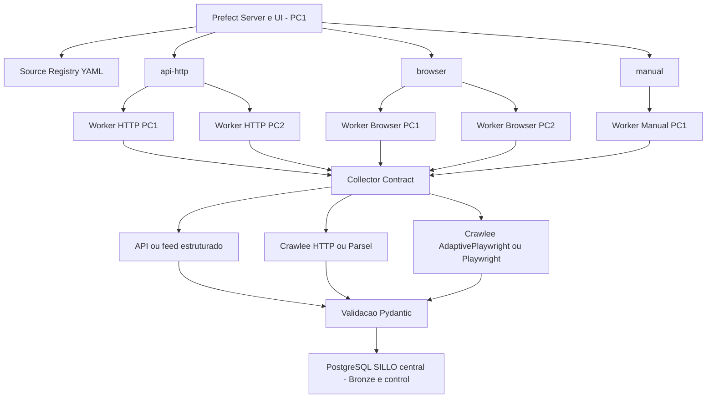

# Arquitetura

## Decisoes

- Uma execucao de fonte pertence a exatamente um worker. A Request Queue interna do Crawlee nao e dividida entre computadores.
- API/feed precedem HTTP; browser e o ultimo recurso normal.
- O Prefect orquestra apenas coleta, validacao e Bronze.
- Redis existente e reutilizado para mensageria/cache do Prefect; o banco do Prefect e separado do banco de negocio.
- PC1 e o control node e tambem worker. PC2 possui apenas workers e usa o mesmo Prefect e o mesmo PostgreSQL SILLO.
- Filas e limites de worker evitam multiplicacao acidental de browsers. O limite interno de cada fonte permanece no registry.
- Toda coleta possui `pipeline_run_id` e `source_run_id`; retries nao removem a idempotencia das tabelas Bronze.

## Extensao de fonte

1. Criar ou reutilizar um collector em `pipelines/collection/collectors`.
2. Criar um parser puro em `pipelines/collection/parsers`.
3. Registrar a fonte em `config/sources/current.yaml`.
4. Definir estrategia, retries, timeout, concorrencia, rate limit e schedule.
5. Adicionar fixture e parser contract test.
6. Rodar canary e comparar com o legado; so entao habilitar a fonte e sua agenda.

Implementacoes autenticadas futuras devem receber credenciais por `.env`/secret e nunca registrar senha, token, cookie ou cabecalho `Authorization`.
